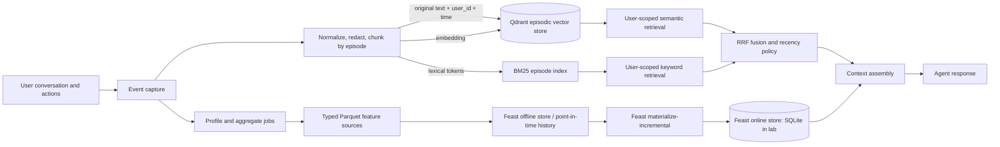

# Hybrid Memory: Episodic Retrieval + Stable Profile

## Architecture and data flow

The system separates two kinds of memory because they answer different questions. Episodic memory keeps evidence about a particular interaction: what the user asked, which constraints they gave, and when it happened. Stable profile features hold compact, typed facts and aggregates that should be available cheaply on every request. A query about “the architecture we discussed yesterday” belongs in episodic retrieval; “preferred language is Vietnamese” belongs in the profile. The response path retrieves user-filtered episodes from Qdrant, retrieves stable values from Feast's online store, and assembles both into one context. The write path records an episode first and updates profile aggregates through a separate, auditable materialization job. It does not turn every utterance directly into a permanent profile fact.

The diagram shows BM25 and vector retrieval as parallel readers over episodic memory. Each reader returns a ranked candidate set, and Reciprocal Rank Fusion (RRF) combines their ranks. This lets exact identifiers, product names, and code terms contribute alongside semantic paraphrases. The user identifier is a mandatory predicate in both paths; filtering only after retrieval would risk leaking another user's text and could allow a large tenant to crowd out a small tenant's candidates. Stable features are fetched by entity key in a single Feast online request. Offline Parquet remains the source of truth for historical training and point-in-time joins, while the online store serves the latest materialized values. The system can therefore reconstruct what was known at an event timestamp without treating today's profile as historical truth.

## Decision 1: chunking strategy

A conversation turn is not automatically a useful memory unit. I chunk by coherent episode or task boundary, targeting roughly 180–350 Vietnamese/English tokens, and keep a small overlap only when a boundary splits a reference such as “that service” from its antecedent. Each chunk retains `user_id`, `conversation_id`, turn range, event time, and a stable memory ID. Short turns that contain a durable preference can remain a single chunk; long troubleshooting threads are split around topic changes and code blocks. This balances retrieval precision and context: one embedding per entire conversation blurs distinct intents, while tiny sentence fragments lose pronouns, negation, and the condition that gives a preference its meaning. I retain the original text and store a normalized retrieval string separately so the displayable evidence is never silently rewritten. A later summarizer can propose a profile update, but a human- or policy-controlled validation step decides whether that update is durable.

A rejected alternative is fixed, non-overlapping 50-token windows for every conversation. It gives predictable vector sizes, but Vietnamese compounds and short code-switching phrases are often split at arbitrary whitespace boundaries. A chunk containing “không dùng Redis” without its surrounding deployment constraint can even reverse the apparent meaning. Fixed tiny windows also multiply vectors, storage, and near-duplicate candidates, making per-user recall noisier. The episode-boundary approach costs a little ingestion logic and can produce variable chunk sizes, but preserves a more complete proposition and keeps provenance that can be shown to the user.

## Decision 2: feature schema

The stable profile is an explicit, typed schema keyed by `user_id`, not a free-form JSON blob. It includes slow-moving fields such as preferred language and reading-speed band, plus bounded aggregates such as topic affinity and query counts. Each row has an event timestamp and, in production, a source/version marker. Feature names describe meaning and units (`reading_speed_wpm`, not `speed`) and numeric types are fixed; bounded categories use controlled values. For a multi-topic interest, production should prefer a small top-N list or a normalized category distribution rather than an unbounded list of every phrase ever mentioned. The lab's single `topic_affinity` string is a teaching simplification, not a recommendation to collapse all interests into one label.

A rejected alternative is storing the whole profile as one serialized string or embedding. That would make schema changes easy at first, but prevents Feast from validating types, querying one feature independently, applying per-feature TTLs, and exposing reliable null/default behavior. It also makes online consumers parse a changing blob at request time. Conversely, one feature view per scalar would create needless registry and materialization overhead. A small number of views grouped by entity and freshness domain gives useful typing without exploding operational objects. Sensitive facts should be excluded or minimized; profile reads must be scoped to the authenticated user and writes need a deletion/consent path.

## Decision 3: freshness strategy

Freshness follows the meaning and acceptable staleness of each feature. Stable preferences can be updated by a daily batch and retained with a longer TTL (for example, 30 days). Item popularity may be refreshed hourly with a shorter, roughly one-day TTL. Query velocity is a near-real-time aggregate, updated every few minutes or by a stream processor and expired after about an hour. These values are explicit starting points to validate with product owners, not universal constants. Materialization is incremental and event-time aware; a late event must not overwrite a newer value just because it arrived later. The offline store keeps timestamped history, and training uses Feast point-in-time joins to avoid future leakage. The online store is a serving cache of the latest eligible feature values, not the only record of truth.

A single global freshness interval was rejected. A one-hour TTL for every value would evict legitimate stable preferences during quiet periods, while a 30-day TTL for query velocity would make a burst signal look current long after it stopped. The chosen policy trades freshness, compute cost, and stale-read risk separately by view. Monitoring should report source lag, materialization duration, missing-feature rate, and online lookup P50/P95/P99. If lag crosses the product's budget, the system should expose a stale or missing state rather than silently pretending a value is fresh.

## Vietnamese retrieval considerations

Vietnamese search must handle more than Unicode accents. Conversations frequently switch languages inside one phrase: “scale up cloud khi traffic tăng”, “chạy query này trên Feast”, or a Vietnamese sentence containing a Python symbol or model name. Normalization should canonicalize Unicode to NFC, lowercase ordinary words for lexical matching, and preserve code, identifiers, URLs, and the original text. The BM25 baseline in this lab uses whitespace tokens; that is fast but treats multi-syllable words inconsistently. A production tokenizer such as VnCoreNLP, underthesea, or pyvi can add word segmentation, but its output should be evaluated against the corpus because compound boundaries and technical vocabulary differ by domain. Keeping a character n-gram or raw-token field alongside segmented tokens can protect exact identifiers and unseen technical terms.

Telex input creates another failure mode: users may type “toi muon tim kiem” or make malformed forms such as “ddien toan dam may”, while the indexed note contains “điện toán đám mây”. Blindly stripping all diacritics creates collisions and damages proper names; blindly converting every `dd`/`aw` sequence can corrupt English code-switching and identifiers. The ingestion path therefore stores raw text, an NFC-normalized form, and optionally a conservative diacritic-insensitive or Telex-corrected retrieval variant. Query rewriting should be additive: search the original query first, then a small set of normalized alternatives, and fuse results rather than replacing the user's words. A domain alias table can map “cloud”, “đám mây”, and common spelling variants without rewriting displayed evidence. Evaluation should contain accented Vietnamese, unaccented text, realistic Telex errors, English technical phrases, code identifiers, negation, and mixed-language queries. Recall and privacy must be measured per user as well as globally, since a normalization improvement that increases cross-user leakage is unacceptable.

The practical rule is to normalize for retrieval while preserving the source, use typed online facts only for validated stable information, and keep the full time-stamped episode available as evidence. That division keeps the response fast without sacrificing explainability, temporal correctness, or Vietnamese-language recall.
